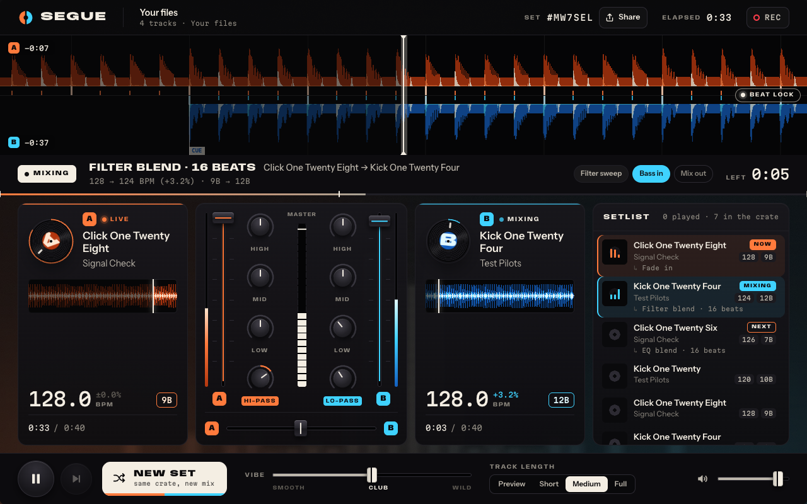

# Segue

**Your playlist, DJ'd live. Never the same set twice.**

Paste a Spotify playlist link and Segue plays it as a continuous, beat-matched DJ set in your browser:
blends, bass swaps, filter sweeps, echo-outs, spinbacks and drops, with the decks, waveforms and mixer
moving as it happens. Press *New set* and the same playlist becomes a different mix.

**Live: https://aarushkandukoori.github.io/segue/**



No sign-up, no backend, no build step. It is a static site of plain ES modules with zero runtime
dependencies.

## How it works

```
 what you paste          track list            audio               analysis             planner               engine
┌───────────────┐    ┌───────────────┐    ┌──────────────┐    ┌───────────────┐    ┌────────────────┐    ┌───────────────┐
│ Spotify link  │    │ title, artist,│    │ 30 s preview │    │ tempo + beat  │    │ order, cue     │    │ Web Audio:    │
│ Deezer link   │ ─▶ │ duration      │ ─▶ │ from Deezer  │ ─▶ │ grid, key,    │ ─▶ │ points, which  │ ─▶ │ two strips,   │ ─▶ speakers
│ "Artist-Title"│    │ (never audio) │    │ or Apple; or │    │ loudness,     │    │ transition and │    │ EQ, filters,  │
│ your own files│    │               │    │ your file    │    │ energy, cues  │    │ when, as a plan│    │ delay, reverb │
└───────────────┘    └───────────────┘    └──────────────┘    └───────────────┘    └────────────────┘    └───────────────┘
   js/sources            js/sources           js/sources          js/analysis         js/dj/planner          js/dj/engine
                                                                  (Web Worker)        js/dj/transitions      js/dj/fx
```

- **Sources** read the track list. Spotify pages cannot be read from another website, so the playlist's
  public embed page is fetched through public relays; Deezer links and charts are read directly.
- **Audio** for each track is a 30-second preview matched by title, artist and length on Deezer, with
  Apple's iTunes previews as a fallback. A weak match is skipped rather than played as the wrong song.
- **Analysis** runs in a Web Worker: tempo and beat grid, downbeat, musical key (shown as Camelot codes),
  loudness, energy and the waveform. Results are cached in IndexedDB.
- **The planner** is a pure function of seed + analyses. It picks the next track from the first five
  unplayed ones (tempo, key, energy arc, no artist twice in a row), decides where to leave one track and
  enter the next, and writes the transition as timed automation: rate points and fader / EQ / filter /
  send events.
- **The engine** executes that plan with sample-accurate Web Audio scheduling. Timers only do
  bookkeeping, so a busy tab or a background tab does not move a beat.
- **The conductor** (`js/dj/conductor.js`) keeps it running: prepares tracks three at a time, hands each
  transition to the engine well ahead of time, and loops through the playlist endlessly.

When two tracks are within 8 % in tempo and both beat grids are trusted, the incoming track is sped up
or slowed down to match, its downbeat is placed on a downbeat of the outgoing track, and it glides back
to its own tempo afterwards. Otherwise the planner uses moves that need no sync: echo-out, reverb wash,
cut, spinback, brake, loop roll, riser and drop.

## What makes each set unique

Every set has a six-character seed. The seed decides the running order, which track opens, the
transition type for each pair, its length, the cue points and the small tricks in between (filter dips,
echo throws, beat repeats, builds). The *Vibe* slider shifts the odds from long smooth blends to cuts,
rolls and spinbacks.

The address bar always holds a link to the set that is playing (`?p=<playlist>&seed=<seed>`). Opening
that link rebuilds the same set: same order, same transitions.

## Honest limits

- **30-second previews, not full songs.** Spotify's audio is DRM-protected and its developer policy
  forbids mixing or overlapping Spotify content, so Segue never touches Spotify audio. Spotify is used
  for the track list only; the sound is the preview clip Deezer or Apple publish for the same recording.
- **Full-length sets need your own files.** Drop audio files on the page and they are mixed at full
  length (Short / Medium / Full track length). They are decoded locally and never uploaded.
- **Public playlists only**, and only the first 100 tracks: that is what Spotify's public embed exposes.
- **The Spotify track list depends on third-party relays** that offer no guarantees. If they are all
  down, the demo crates, Deezer links, pasted lists and local files still work.
- **Not every track has a preview.** Typically 90 % or more of a mainstream playlist resolves; the rest
  is marked "No audio" and skipped.
- **No key lock.** Beat-matching changes playback speed, so a matched track is also pitched by up to
  ±8 % until it glides home.
- **Beat grids are estimated.** On dance, pop and electro charts the two tracks' drums land within 20 ms
  of each other in about 85–90 % of beat-matched blends (measured by `tests/e2e/mix.e2e.mjs`). Syncopated
  material (hip-hop, reggaeton) is harder: there, roughly a third of blends have the two tracks'
  strongest hits half a beat apart, sometimes because the music accents the off-beat and sometimes
  because a grid is half a beat off.
- The whole app is tested in headless Chrome; the interface was also loaded in Firefox. Audio in Safari
  (including iOS) and Firefox has not been verified yet.

## Privacy

There are no accounts, no analytics, no cookies and no server of Segue's own. The playlist address you
paste passes through third-party relays (web.scraper.workers.dev, r.jina.ai, api.microlink.io) so the
page can be read, and track titles are sent to Deezer's and Apple's public search to find previews.
Volume and vibe are remembered in your browser's local storage; analysis results are cached in
IndexedDB. Local files stay on your device.

## Run it locally

```
git clone https://github.com/aarushkandukoori/segue.git
cd segue
npm run serve        # http://127.0.0.1:4173 — a tiny static server, no install needed
```

Any static file server works. There is nothing to build.

## Tests

```
npm install          # dev only: puppeteer-core, to drive your installed Chrome
npm test             # 309 node tests: planner, transitions, analysis, sources, conductor
npm run e2e          # all headless-Chrome suites in sequence (needs Chrome and the network)
npm run e2e:app      # the whole app against the real network: demo crate, Spotify link, share link,
                     #   skip, new set, pause, local files, pasted list, phone viewport, recording
npm run e2e:mix      # mix quality on real previews, rendered offline through the real engine:
                     #   beat alignment of beat-matched pairs, no clipping, no gaps, no clicks
```

## Layout

```
index.html, css/          the page
js/main.js                wiring: view ↔ conductor, URL, share, recording, Media Session
js/ui/                    the view (state in, DOM out)
js/sources/               playlist readers, preview matching
js/analysis/              tempo, beats, key, loudness, waveform (runs in a Worker)
js/dj/                    planner, transitions, engine, fx, conductor
tests/                    node tests; tests/e2e/ headless-Chrome suites
```

## Roadmap

- Licensed full-track sources
- Key-lock time-stretching, so matched tracks keep their pitch
- Stems (drums / bass / vocals) for acapella and instrumental blends
- Live crowd controls: requests, energy votes, shared sets

## Credits and licence

Built by Aarush Kandukoori. MIT licence, see [LICENSE](LICENSE).

Segue is not affiliated with Spotify, Deezer or Apple. Track names, artwork and previews belong to
their owners and are loaded from those services at play time; nothing is stored or redistributed.
